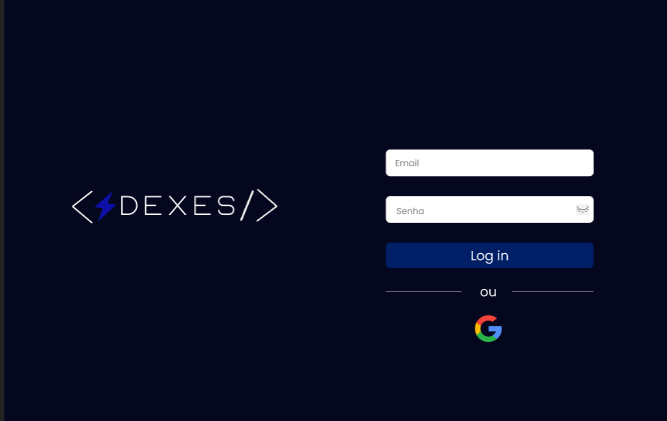
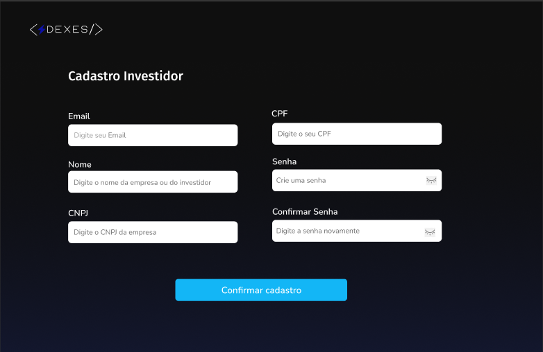
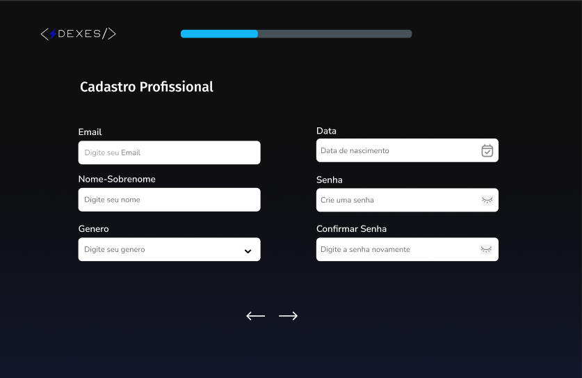
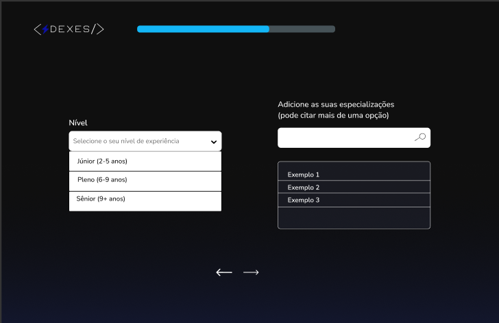
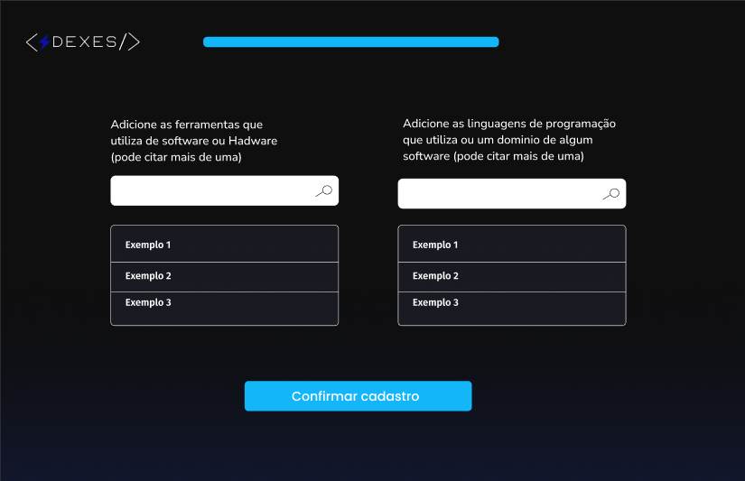

# Dexes

## Descrição do Projeto

O **Dexes** é um web site destinado a facilitar a divulgação dos projetos e a comunicação eficiente entre profissionais das principais áreas da tecnologia e investidores interessados nos projetos, abrangendo desde iniciantes até especialistas. O objetivo é garantir que os usuários possam adquirir reconhecimento aos seus projetos e aprimorar suas competências por meio de uma rede colaborativa.

O site possui diversas funcionalidades, como um chat para comunicação direta entre os usuários, possibilitando uma troca rápida e eficiente de informações. Cada usuário pode criar, editar e excluir seu perfil pessoal, onde será possível compartilhar informações sobre sua experiência e interesses profissionais. Junto com o perfil, há um portfólio para divulgar os projetos realizados e os serviços prestados, além de permitir a adição de feedbacks sobre os trabalhos executados.

Para encontrar outros profissionais e investidores, há uma aba de pesquisa, onde os usuários podem procurar por projetos e ideias de projetos. E, ao clicar no botão “Especialização”, o usuário ou investidor será direcionado para questionários que ajudarão a definir a área em que deseja negociar, trabalhar e investir, facilitando a conexão com os profissionais e negociadores mais qualificados.

Siga-nos no Instagram para acompanhar as novidades: [@dexes_project](https://www.instagram.com/dexes_project?igsh=MXg1NzM1cG9icDRwMA==).

## Requisitos do Sistema

### Requisitos Funcionais (RF)

 **[RF 001]** - O sistema deve permitir que o usuário realize seu cadastro perfeitamente.  
  *Descrição: Página de cadastro para novos usuários.*

 **[RF 002]** - O sistema deve permitir que o usuário investidor realize seu cadastro perfeitamente.  
  *Descrição: Página de cadastro para novos investidores.*

 **[RF 003]** - O sistema deve permitir que o usuário faça login na sua conta a partir do Gmail e GitHub.  
  *Descrição: Integração com a API de login do Google e GitHub.*

 **[RF 004]** - O sistema deve permitir que o usuário modifique seu perfil dentro dos limites especificados.  
  *Descrição: Funcionalidades para editar foto, nome, biografia, entre outros.*

  **[RF 005]** - O sistema deve permitir que o usuário possa cadastrar seu projeto
   *Descrição: Cadastrando o projeto, poderá citar a proposta e informações do projeto, como nome, logo, participantes...*
   
  **[RF 006]** - O sistema deve permitir a edição  e exclução do projeto
   *Descrição: Funcionalidades para editar a logo, nome, descrição ou proposta, participantes da equipe e entre outros.*
   
  **[RF 007]** - O sistema deve ter um chat.  
  *Descrição: Chat simples para comunicação direta entre os usuários, podendo enviar videos, imagens e lincks.*

  **[RF 008]** - O sistema deve ter uma aba de pesquisa.  
  *Descrição: Aba de pesquisa para projetos, ideias de projetos, e usuarios.*

 **[RF 009']** - O sistema deve ter uma função para divulgar os projetos feitos pelo profissional.  
  *Descrição: No perfil do usuario profissional, teria os projetos que participou realizados.*

 **[RF 010]** - O sistema deve ter uma função de especificação do projeto que o usuário procura.  
  *Descrição: Questionários para recomendar projetos ou idias com base nas respostas.*

 **[RF 011]** - O sistema terá um rankeamento por projetos mais ativos na comunidade.  
  *Descrição: Emblemas de bronze a ouro, no maxímo 10 projetos mais ativos na comunidade e sendo bem avaliados.*

 **[RF 012]** - O sistema permitirá postagens na comunidade e no perfil do usuário.  
  *Descrição: Postagens relacionadas a trabalhos, videos, imagens e Links.*

 **[RF 013]** - O sistema deve realizar as funções de administrador.  
  *Descrição: Exclusão de postagens e perfis em caso de denúncias.*

 **[RF 014]** - O sistema fornecerá a opção de denúncia.  
  *Descrição: Funcionalidade para denunciar postagens e usuários.*

 **[RF 015]** - O sistema deve permitir feedbacks.  
  *Descrição: Avaliação dos projetos e usuarios, com estrelas ou comentários.*

## Protótipo das Telas de Login e Cadastro

### Tela de Login

### Tela de Cadastro  Investidor

### Tela de Cadastro  Profissional (Parte 1)

### Tela de Cadastro (Parte 2 - Seleção de Experiência e Área)

### Tela de Cadastro (Parte 3 - Seleção de softwares e Linguagens de programação)

## Colaboradores do Projeto e as funções que irão exercer

| Integrantes da equipe | Requisitos Funcionais (RF)                        |
|-----------------------|---------------------------------------------------|
| Ana Carolina          | [RF 002], [RF 005], [RF 007], [RF 008], [RF 013]  |
| Gabriel Castanhel     | [RF 001], [RF 003], [RF 004], [RF 012], [RF 014]  |
| Pedro Henrique        | [RF 006], [RF 009], [RF 010], [RF 011], [RF 015]  |
